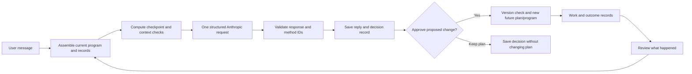

# Adler: the implemented coaching program and runtime

This build is a local, single-user React/Vite application. Goals, results, action records, program versions, confirmed context, conversation and decision history are saved in the browser. The API runs in Node through a Vite plugin in development and preview. A static `dist` deployment alone does not provide coaching or calendar APIs.

## What the coach actually is

Adler uses a small application-owned harness around Anthropic’s TypeScript SDK. It does **not** use Google ADK, an Agents SDK runner, multiple specialist agents, model fine-tuning, or an autonomous background loop.



Each turn assembles:

- The selected goal, completion criteria, result history, dated checkpoints and current plan.
- All active goals, their areas/tags, the current sprint and focus, weekly capacity and work hours.
- Recent action records, user-confirmed context, relevant conversation and recent decisions/reviews.
- Saved scheduled work. Calendar availability is included only if explicitly checked in the past five minutes. No calendar credentials or unrelated event titles are sent to the model.
- Six deterministic checks: outcome/checkpoint, observations, sprint/cross-goal demands, schedule/capacity, confirmed context and enabled methods.

The model receives a structured coaching instruction to assess the outcome, evidence, constraints, blocker and relevant enabled methods, then synthesize a concise reply and at most one proposed future plan change. Methods are instructions applied within that single call; there is no separate model run for every method. Structured JSON output and Zod validation constrain the response. The client checks that returned methods are enabled. The model cannot directly write to calendars or change the program.

A decision record saves the input checks, method IDs, program and plan versions, explanation, proposal and user decision. The program page shows current context and historical decision snapshots. These are user-facing explanations and records, not private model chain-of-thought.

“Learning” here means reusing new observations, confirmed context, reviewed trials and approved program revisions on subsequent turns. It does not mean retraining model weights or claiming a causal effect from a short personal trial. A proposed change includes a reason and a review criterion; the user can later record what happened and choose to keep or revisit it.

## What the user can edit

`/app/coach/program` exposes the focus goal, sprint result and dates, weekly capacity, available weekdays and hours, session length, review day, current approach and enabled methods. Saving creates a new version. An old form cannot overwrite a newer program. Accepting a coaching proposal similarly checks the original program/plan versions and changes future work while keeping recorded actions intact.

`/app/coach/about-you` holds user-confirmed context. Goals have areas, tags and priorities. The progress screen edits dated checkpoints and preserves the previous schedule and reason for a change.

Progress uses recorded results versus the latest checkpoint due by today, in the same units. It does not fit an invented linear trajectory. Missing evidence or evidence older than seven days produces “Update needed.” The seven-day threshold is a product rule, not an empirically optimal interval. Completed actions do not automatically count as completed outcomes.

## Calendar connections

Google uses server-side OAuth with session-bound, expiring, one-use state. Scopes cover calendar selection, free/busy and events on owned calendars. Tokens refresh during the server session. Configure:

```dotenv
GOOGLE_CLIENT_ID=your-web-client-id
GOOGLE_CLIENT_SECRET=your-client-secret
GOOGLE_REDIRECT_URI=http://localhost:55011/api/calendar/google/callback
```

Register the exact callback for the port you run and enable the Calendar API in the Google project. External OAuth testing mode can require reconnecting after seven days. Adler stores tokens in server memory, so a server restart also requires reconnecting.

Apple connects iCloud calendars through CalDAV using `tsdav`, an Apple Account email, and an app-specific password. It does not include unrelated local, Google or Exchange calendars merely because they appear in Apple Calendar. Credentials stay in server memory. Calendar objects are parsed with `ical.js`. The server requests recurrence expansion and fails closed on unresolved recurrence/floating time zones rather than treating unreadable events as free time. All-day dates conservatively block their possible timezone span. Shared read-only calendars can reject writes; this is surfaced as failure.

Calendar booking is an explicit user command. The server rechecks selected calendars and the destination before writing a work block and optional five-minute check-in. Stable IDs and a private `.context/calendar-bookings.json` journal allow partial/uncertain writes to be reconciled before retrying. The UI distinguishes a confirmed work event from an unconfirmed check-in. External changes can still race a booking: providers do not offer an atomic cross-calendar lock.

Adler-only scheduling is clearly labeled and never claims external conflicts were checked. Calendar events use the provider’s default notifications; no proactive coach runs when the app is closed. Existing calendar events remain if browser records are reset or the provider is disconnected.

## Running and current provider status

```sh
npm install
npm run dev -- --port 55011
npm run build
npm test
```

Live coaching uses server-only `ANTHROPIC_API_KEY` and optional `ANTHROPIC_MODEL` (default `claude-sonnet-5`). On September 5, 2026, a controlled request with fictional data reached the provider but was rejected for insufficient API credits. No successful live response has been verified in this environment. UI/context/approval behavior is tested using explicit fixtures; there is no silent fallback to scripted guidance or another provider.

Google OAuth credentials are not configured and no iCloud account has been supplied. Adapter tests cover availability errors, partial writes, uncertain successful writes, retries after conflicts, and failed iCloud writes. Real-account acceptance remains: connect, verify a known busy period, book a chosen work/check-in pair, and confirm the events in the provider calendar.

The API rejects non-loopback Host headers and mismatched origins. Private workspace files are denied by the serving layer. This remains a local single-user preview: production deployment needs authentication, per-user server storage, credential protection, retention controls and a deployed API. Browser reset does not delete the server booking journal; remove that private file separately if desired, after resolving outstanding bookings.

## Primary references

- [Anthropic structured output](https://platform.claude.com/docs/en/build-with-claude/structured-outputs) and [TypeScript SDK](https://platform.claude.com/docs/en/cli-sdks-libraries/sdks/typescript).
- [Google web-server OAuth](https://developers.google.com/identity/protocols/oauth2/web-server), [Calendar scopes](https://developers.google.com/workspace/calendar/api/auth), [free/busy](https://developers.google.com/workspace/calendar/api/v3/reference/freebusy/query), and [event creation](https://developers.google.com/workspace/calendar/api/guides/create-events).
- [Apple app-specific passwords](https://support.apple.com/en-us/102654), [tsdav Apple setup](https://tsdav.vercel.app/docs/), and [calendar object queries](https://tsdav.vercel.app/docs/caldav/fetchCalendarObjects).
- Behavioural sources, application examples and limits are listed individually in `src/methods.ts` and the app’s public Method page. They support the individual mechanisms in studied settings, not an efficacy claim for Adler as a combined product.
