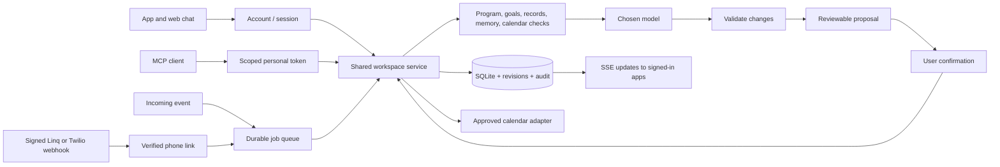

# Adler runtime

The app, web coach, iMessage/SMS conversation, and MCP tools read and change the same account-owned SQLite workspace. New accounts start empty. The landing demo is fictional and does not seed account records.

## Run locally

```sh
npm install
npm run dev -- --port 55020
```

Open `http://localhost:55020`, create a username and password, then describe a goal in Today. The first conversation and plan stay in one guided flow. Add a provider API key in **Settings → AI provider**, save/test it, and start a conversation. Coaching is available automatically once a provider is configured. Passwords use salted scrypt; HTTP-only session cookies identify the account. Email verification and password recovery are not configured.

The API accepts requests only for a recognized `Host`. With `PUBLIC_URL` set, that is exactly the public host. Without it, the runtime accepts `localhost`, `127.0.0.1` and `[::1]`, and — only while `NODE_ENV` is not `production` — RFC1918 private IPv4 hosts (`10/8`, `172.16/12`, `192.168/16`), so a phone on the same Wi-Fi can reach a development Mac at `http://10.0.0.24:8080`. Any other host is refused with 403. Setting `PUBLIC_URL` or `NODE_ENV=production` restores the single-host rule. See [Adler for iOS](ios-app.md).

For the production server, build and provide configuration through the process environment:

```sh
npm run build
npm start
```

`npm start` serves the built SPA, authenticated API, SSE updates, MCP endpoint, and persistent job worker on port 8080. It does not load `.env` itself. Vite loads `.env` during development; Docker Compose passes it to the container.

## Models, credits, and initial goal setup

There are three REST adapters, selected per account, with no automatic provider fallback:

| Provider | Default model | Interface |
| --- | --- | --- |
| Google Gemini | `gemini-3.8-flash` | Interactions, JSON schema |
| OpenAI | `gpt-5.6-luna` | Responses, strict structured output |
| Anthropic | `claude-sonnet-5` | Messages, structured output |

The user can enter a different compatible model name. Defaults were checked against provider documentation on September 5, 2026. Model access still depends on the user's account. Chat product subscriptions do not supply this app's API credits. Calls are charged directly to the selected API account; Adler does not sell credits, inspect a provider balance, or implement subscription billing.

Personal keys and calendar credentials are encrypted with AES-256-GCM and are never returned through API status, exports, chat, or MCP. A small **Save & test connection** call verifies actual structured generation and costs a small amount of provider usage. A successful test records its time. Environment keys can be used on a private local dev server; deployed servers require explicit `ADLER_ALLOW_SERVER_KEYS=true` before users can select the host's account. Keep this false for public BYOK deployments.

Initial goal setup uses the same configured model as ongoing coaching. It clarifies the intended result and needed context one question at a time. It investigates relevant scientific literature and returns a typed goal/program proposal with a sourced explanation. Explicit creation requests save a Draft; recommendations wait for approval. Start plan activates a draft and opens the next action. See [Guided goals](guided-goal-journey.md). Manual setup needs no AI key. A goal can use a relevant outcome measure; goals without one use verified milestones or the legacy learning assessment. Action observations remain separate.

Actual validation in this workspace: Gemini's connection test and a fictional end-to-end goal proposal/approval succeeded. Provider protocol tests cover all three adapters. Live OpenAI access was not configured; the available Anthropic account previously reported insufficient credits. No model is silently substituted when billing or access fails.

## The coaching harness

This is an application-owned harness, not Google ADK or an Agents SDK. It has persisted state, deterministic context checks, a cross-provider structured generation step, server validation, explicit proposals, shared commands, and durable channel workers. It does not claim model training or autonomous self-reprogramming.



The context checks cover goal results and checkpoints, action observations, sprint focus and competing goals, time constraints, confirmed personal context, and enabled methods. Each response saves the checked context and a concise rationale with method references. This is a decision record, not a private reasoning transcript. Program edits create saved versions and change the instructions/context used on later calls; they do not retrain the foundation model. Individual methods have research references in `src/methods.ts`; the combined product has not been evaluated for effectiveness.

`server/commands.ts` is the mutation catalog. It supports goals, plans, milestones, checkpoints, action outcomes, learning results, confirmed memories, program revisions, weekly reviews, preferences, and work blocks. Credentials and account linking stay in authenticated Settings. External calendar work blocks require a connected provider, explicit calendar IDs, checked availability, and confirmation. Existing external events are managed at their calendar provider; modifying/removing an Adler goal does not silently delete its calendar events.

All channel writes for an account share a lock. SQLite writes are short transactions; no transaction stays open during a model or calendar request. App writes use revision checks; stale writes are rejected and the browser reloads the current records instead of overwriting an SMS/MCP update. Proposals are scoped to their owner, expire after 24 hours, and are rejected if relevant records changed after preparation. Repeated approval and repeated inbound message IDs do not repeat mutations.

## iMessage, SMS, and scheduled coaching

For native iMessage with automatic RCS/SMS fallback, follow [Linq setup](imessage-setup.md). The adapter verifies signed webhooks, persists event/message identities, replies in the paired conversation, and supports six standard native reactions. Incoming tapbacks update the original message without recording progress or approving a proposal. The shared model can include an acknowledgement reaction, and MCP exposes `react_to_message` through the same service. No Linq account or live iMessage delivery has been verified yet.

Linq is the default messaging provider. Set `MESSAGING_PROVIDER=twilio` for the optional SMS-only adapter below; follow [Twilio setup](twilio-setup.md). Both adapters invoke the shared Adler service and do not own separate coaching prompts or memory stores.

Configure a Twilio SMS-capable sender, `TWILIO_ACCOUNT_SID`, `TWILIO_AUTH_TOKEN`, `TWILIO_NUMBER` (E.164), and the exact public HTTPS `PUBLIC_URL`.

Set the sender's incoming message webhook to:

```
POST https://YOUR_HOST/api/webhooks/twilio/inbound
```

The runtime attaches its status callback automatically:

```
POST https://YOUR_HOST/api/webhooks/twilio/status?delivery=...
```

The callback signature is validated against the exact public URL and form fields, including the account and recipient. Configure the reverse proxy to preserve the public Host and path. The runtime does not trust arbitrary forwarded headers. Enable Twilio's opt-out handling; when `OptOutType` is present Adler avoids duplicating HELP/opt-out responses.

In **Settings → Connections**, enter the phone number and generate a ten-minute pairing code. Send `LINK <code>` from that exact phone to the Adler sender. Knowing or entering someone else's number does not link it: the signed inbound message from that number redeems the one-use code. Pairing enables conversational replies. Scheduled work check-ins and review invitations require a separate checkbox.

Examples after pairing:

- “Help me define a goal to publish two essays this month.”
- “I drafted the outline; mark that session done.”
- “Move my sprint focus to the course goal.”
- “Review my week and help me choose one adjustment.”
- `CONFIRM <proposal code>` applies the displayed proposal.
- `KEEP <proposal code>` / `DISMISS <proposal code>` keeps the current plan.
- `DETAILS <proposal code>` repeats the proposal.
- `STOP` stops texts; `START` resumes; `HELP` returns usage guidance.

Incoming MessageSids are persisted and deduplicated before the empty TwiML acknowledgement. A worker handles model calls after acknowledgement. Session outcomes do not automatically complete goal milestones. SMS replies and confirmed changes appear in the app conversation. The web app can approve a proposal that started through SMS or MCP.

The worker creates timezone-aware weekly-review invitations and check-ins after saved work blocks. Jobs are persisted, leased, and recovered after a restart; duplicate scheduling uses stable job IDs. Quiet hours defer scheduled messages. Paused goals, recorded actions, opted-out phones, completed recent reviews, and disabled automation suppress relevant sends. Missed scheduled invitations older than a day are skipped. Internal transient generation failures retry up to three attempts with backoff and stable request IDs.

Outbound delivery intents are persisted before calling Twilio. A provider-accepted `queued` response is distinct from an unsent local queue entry. If a request times out after it may have reached Twilio, delivery becomes **unknown** and is not automatically resent. Signed callbacks can reconcile it; later `sent` callbacks do not regress a delivered status. The Connections screen shows job failures and delivery states. A message already transmitted before STOP cannot be recalled.

Phone pairing is shared by Linq and Twilio. The Twilio inbound adapter also recognizes WhatsApp addresses, but proactive WhatsApp messages outside its 24-hour reply window need approved templates; this version records that limitation instead of pretending to deliver them. No real phone messages were sent during implementation; tests use signed fixtures and injected/mock transports.

## MCP and incoming events

Create a 30-day MCP token in **Connections**, then configure a compatible client with:

```json
{
  "url": "https://YOUR_HOST/mcp",
  "headers": { "Authorization": "Bearer YOUR_PERSONAL_TOKEN" }
}
```

The endpoint uses the official MCP SDK's stateless Streamable HTTP transport. GET/DELETE are not used. A fresh authenticated server/transport handles each POST. Tools: `get_workspace`, `get_command_catalog`, `propose_changes`, `apply_proposal`, `dismiss_proposal`, `coach_message`, `react_to_message`, `connected_calendars`, and `calendar_availability`. Coaching requests use `coach_message` to run Adler’s shared model/program; direct mutation tools handle explicit record edits. The apply tool requires the caller to have shown the exact proposal and obtained user confirmation. Tokens are stored as hashes, have an expiry and scope, and can be revoked.

This is personal bearer-token access, not an OAuth authorization server. Clients that require OAuth discovery/registration, including some hosted connector flows, need an additional OAuth service. Do not advertise universal connector compatibility.

For a source that can POST events, create a separate **webhook** token:

```http
POST /api/webhooks/events
Authorization: Bearer YOUR_WEBHOOK_TOKEN
Content-Type: application/json

{"id":"stable-event-id-001","message":"A progress update for Adler to review."}
```

The event is queued once per account/event ID. Reusing an ID with different content is rejected. The coach treats incoming text as unverified context; it cannot approve its own changes. The event can create a response and proposal in the app even without a phone; linked phones can receive its response. A configured AI provider and available API credits are required. This endpoint does not accept arbitrary shell commands or code.

## Deploy the server

For a Vercel frontend with this persistent server, follow [Deployment](deployment.md). Vercel hosts the frontend and proxies API requests; the SQLite database and worker stay on the persistent backend.

`Dockerfile` builds the Vite app and runs a Node 24 server as an unprivileged user. `compose.yaml` mounts the entire `/data` directory and binds port 8080 to host loopback. Put a TLS reverse proxy in front of it, preserve Host, allow SSE streaming without buffering, and give model requests at least a 90-second proxy timeout.

```sh
cp .env.example .env
# Set PUBLIC_URL, provider policy, calendar OAuth and/or Twilio credentials.
docker compose up --build -d
```

Run **one replica/worker per data directory**. This version uses one SQLite connection and DELETE journaling. Multiple independent processes sharing the same file are not supported. A volume is required; ephemeral filesystems lose account and job state. Back up the entire data directory while the server is stopped, including `encryption.key`. Losing that key makes saved provider/calendar credentials unreadable. Do not copy it into the Docker image, client bundle, or repository.

The deployment artifacts are supplied, and the standalone Node server is exercised separately from Vite. Docker itself is not installed in this workspace, so an image build and live hosted/Twilio deployment remain to be run on the chosen host.

## Tests and remaining deployment work

```sh
npm run build
npm run test:server
npm test
```

Tests cover fresh accounts, isolation, credential encryption, revision conflicts, shared command validation, proposal approval, provider protocols, goal setup, a real MCP client against HTTP, SMS signatures/pairing/deduplication/STOP, uncertain sends, callback ordering, job restart recovery, timezone behavior, browser synchronization, goal/review flows, calendar adapter failures, mobile layout, and automated accessibility checks. Provider/calendar/messaging fixtures do not establish live external account authorization.

Before an internet launch: choose the hosting domain and Twilio sender, configure HTTPS/OAuth callbacks, and decide whether registration stays open (`ADLER_REGISTRATION=closed` disables new registrations). Google OAuth approval, messaging registration requirements, provider model access, email recovery, account deletion/retention automation, and multi-replica scaling are not supplied by this code. Clearing workspace content intentionally preserves account credentials, bookings, audit and delivery records; deployment operators own retention.

## Primary documentation checked

- [OpenAI structured outputs](https://developers.openai.com/api/docs/guides/structured-outputs)
- [Gemini Interactions API](https://ai.google.dev/api/interactions-api)
- [Anthropic structured outputs](https://platform.claude.com/docs/en/build-with-claude/structured-outputs)
- [Linq webhooks](https://docs.linqapp.com/channel/imessage/guides/webhooks/)
- [Linq protocol selection](https://docs.linqapp.com/channel/imessage/guides/messaging/protocol-selection/)
- [Twilio webhook security](https://www.twilio.com/docs/usage/webhooks/webhooks-security)
- [Twilio message resource](https://www.twilio.com/docs/messaging/api/message-resource)
- [MCP Streamable HTTP transport](https://modelcontextprotocol.io/specification/2025-11-25/basic/transports)
