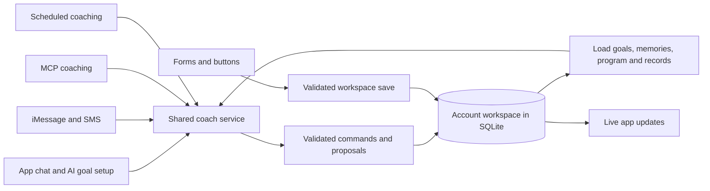

# How Adler's coach works

Adler has one owned coach service, `Service.chat` in `server/service.ts`. Web chat, iMessage, SMS, scheduled coaching, and MCP's `coach_message` call that service. Goal setup through chat uses it too. Switching between Gemini, GPT, and Claude changes the model adapter, not the saved program or coaching instructions. This is a structured agent loop implemented in the application; it does not use an ADK or a separate agent for each interface.

## What it remembers

Each account has a versioned workspace in the SQLite `state` table (`server/database.ts`). The workspace contains goals, results, actions, confirmed memories, program versions, conversations, reviews, and sourced insights. Proposals and their before/after records are stored separately in SQLite. The file defaults to `.data/adler.sqlite`; `ADLER_DATA_DIR` can select persistent server storage. API credentials are encrypted separately in the `secrets` table.

Before each coaching turn, `src/coach-context.ts` loads the current program, all confirmed memories, active goals, recent actions, relevant decisions, and the latest 12 messages in the selected conversation. The service also supplies the current workspace, pending proposals, the command catalog, and connected calendar context. This is direct retrieval from saved records, without embeddings or a separate vector database. Learning means saving confirmed context, testable insights, and program revisions; it does not train the underlying model's weights or autonomously rewrite application code.

## How it plans and takes actions

The instructions ask the model to consider the goal's outcome and checkpoint, observed results, competing goals, time available, reported obstacles, enabled behavioural methods, and a concrete next step. The model returns structured changes and a short explanation. Source IDs and enabled method IDs are checked against the actual records and evidence catalog. Invalid edits receive up to two repair attempts, within a bounded six-round tool loop.

`server/commands.ts` validates changes to goals, plans, milestones, dated checkpoints, actions, measured results, memories, the program, weekly reviews, preferences, work blocks, and conversations. Creating a coach-planned goal materializes the executable tasks and behavior occurrences in its chosen planning window; legacy manual goals retain one first action. UI and coach creation save a Draft; Start plan activates it without duplicating that action. Action completion and measured goal progress remain separate. Explicit chat creation and record edits can save immediately; adaptive plan revisions remain proposals; recommendations, deletion, and external calendar bookings require confirmation. Calendar bookings recheck availability and use stable booking IDs. Text delivery and reactions run through the configured messaging adapter.

MCP exposes workspace reading, the command catalog, coaching, proposing/applying/dismissing changes, message reactions, connected calendars, and calendar availability. The model is given a structured command catalog; it does not have unrestricted shell, browser, or arbitrary network access.

For initial goals and recommended approaches, the coach now searches Europe PMC and Crossref, saves a structured rationale with validated source snapshots, and runs a separate evidence review before saving. See [Guided goals and research-backed planning](guided-goal-journey.md) for the research loop, goal lifecycle, calendar view, and verification.

## What happens when someone uses a form

Direct UI edits go through `POST /api/workspace` and `Service.update`: schema validation, account locking, revision checks, persistent storage, and a sync event. They do **not** make a model call. This path and agent commands share the same workspace and domain validation, but are separate write entry points. Conversation management already uses the command path directly.

That distinction is intentional: clicking a specific date should save that date reliably. Asking “find a better time” invokes the coach. Both changes are available to the next coaching turn in every interface. The regression test “web, iMessage, SMS, and MCP coaching share the model, program, memory, and conversation” starts through the form-save path and verifies the same stored context reaches all four surfaces.

The hosted frontend still needs a persistent backend for SQLite, model credentials, webhook delivery, and scheduled jobs. Vercel's frontend alone is not the persistent coach server.

## Adaptive planning

The goal screen now joins the approach, current work, user-reported status, timeline, forecast assumptions, and reviewable adaptations. Coach is a primary destination again. The coach chooses the work and assessment horizons rather than inheriting a weekly template.

`shared/adaptive-plan.ts` owns decomposition validation, recurrence, prerequisite eligibility, capacity checks, behavior totals, and assessment eligibility. `shared/forecast.ts` calculates conditional cumulative-outcome scenarios from dated observations; supported behavior scenarios also use reported amounts and feedback delay. Probabilities remain unavailable. `server/plan-worker.ts` queues evidence-driven and timed assessments independently of phone setup. Background model calls run outside the account write lock and reject stale conclusions before persistence.

Both workspace saves and commands refresh derived plans and forecasts. A changed capacity remains saveable even if it makes the current plan overloaded; increases in overloaded weeks are rejected. Check-ins never wait for a background model call. Connection context is labeled and editable, and never records an outcome without the user. See [Adaptive planning](adaptive-planning.md) for the contract, verification, and limitations.
