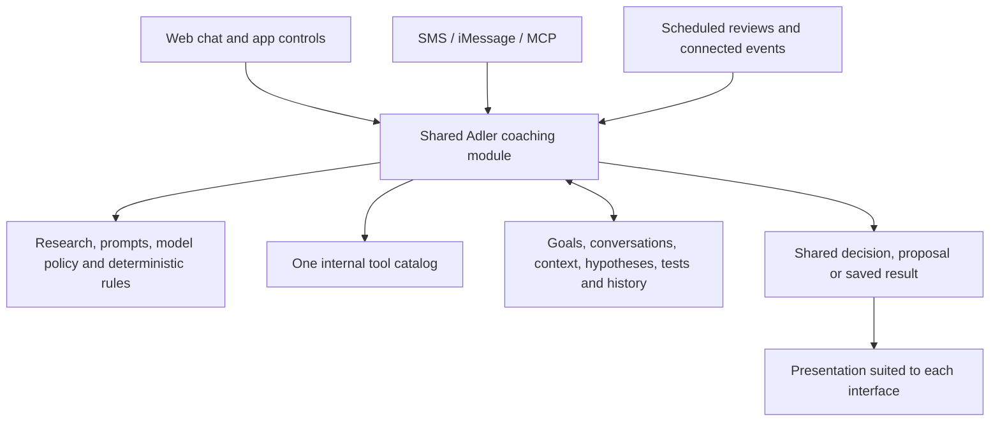

# Adler: one coaching system, a clear experience

Revised proposal · 7 September 2026 · builds on the [full product review](scientific-disclosure-product-proposal.md)

The user accepted all seven areas of the earlier proposal and the direction in this experience plan, then requested deliberate work on the implementation method. The accepted decisions are promoted into [governing product principles](product-principles.md); the [engineering design](method/coaching-engineering.md) develops the HOW, including specific research grounding and live hypotheses/tests. This document supplies the experience examples. It does not assert that the application changes are implemented or replace the current [Adler Method](method/adler-method.md).

## The product we are building

**Adler helps you follow through on your goals by planning manageable actions, learning what helps or gets in the way, and adapting the system around your life.**

Its distinctive value is the continuing connection between the person's goals, chosen work, reports, behavioural interpretation, practical adjustments and subsequent results. Goals, calendar, chat, progress and Insights each make a part of that connection usable. The landing page must make the connection understandable before asking visitors to inspect those features.

The underlying product is one engineered coaching system: research, prompts, model policy, deterministic rules, tool access, shared state, conversations and memory. Web chat, buttons, SMS/iMessage and MCP are different ways to use that system.

The user's experience can stay simple:

1. Tell Adler what you want to achieve.
2. Agree a useful next action that fits your circumstances.
3. Tell Adler what happened.
4. See what it keeps or changes, and why.

The system maintains the methodological depth behind those interactions. A user should not need to manage the coach, select research frameworks or administer experiments to receive useful coaching.

## Changes to the earlier proposal

| Earlier direction | Revised commitment |
| --- | --- |
| Consistent science across channels | One shared coaching module, used by every interaction that requires interpretation or planning, including non-chat controls. |
| A common explanation pattern | A short recommendation with clear controls, followed by observation, behavioural interpretation and expected effect. Deeper evidence remains available. |
| An evolving Insights dashboard | Durable, goal-linked hypotheses and tests in shared memory, with explicit current state, review timing, evidence and resulting learning. Insights is a view of these records. |
| Clearer screens | Design around the user's immediate decision and demonstrate the complete product loop early. |
| Simpler settings and onboarding | Reach a useful first action before asking for optional configuration; learn about the person through use. |

All earlier integrity work remains in scope: provenance, unknown versus zero activity, stale projections, measurement changes, conditional ranges, correction of dependent insights, scientific validation and accurate public claims.

## Landing page: demonstrate the value before the interface

Update, 7 September 2026: the user requests one continuous goal-to-outcome journey. The [landing journey implementation](landing-journey-implementation.md) supersedes the earlier introductory example plus five feature chapters. Keep the chosen headline and established visual brand; organize each stage around what happened and why the next action follows. The story order remains a product hypothesis to test, not a validated conversion result.

The hero should immediately show a small, understandable example of **a report leading to a specific adjustment**. The visitor should not have to reach section 04 to discover that Adler learns from check-ins. Keep the headline, product explanation and call to action readable without scrolling through an animation.

Use the existing fictional **Read 30 books** goal as the continuous example. It supports an understandable outcome and a conditional pages-to-books projection. Keep other goals visible as quiet context, and show broader examples elsewhere so Adler is clearly applicable beyond reading. The demonstration must identify its fictional workspace and distinguish reports, proposals and later feedback.

| Section | What the visitor should understand | What to show first |
| --- | --- | --- |
| Hero | Adler changes the plan using what I tell it and behavioural science. | One brief check-in and the resulting recommendation. Full explanation stays available; the visible reason is specific. |
| 01 — Goals | Adler keeps my goals together and helps me choose workable actions. | A few goal rows, with reading selected and one next action. Keep dense progress details for 03. |
| 02 — Plan | Those actions fit around my existing commitments. | A readable part of the real calendar, enough surrounding commitments to establish fit, and one highlighted reading session. Expand to the full calendar if desired. |
| 03 — Progress | I can see what happened and where my recorded pace could lead. | The same goal's actual outcome line, target, conditional projection and forward range. Preserve dates, legend and a brief assumption. A suggested adjustment does not instantly count as improved performance. |
| 04 — Learning | Adler remembers what it is trying and reviews whether it helped. | A few live tests/insights, with one reading example expanded from its observation to adjustment, later feedback and tentative learning. |
| 05 — Connections | It is the same Adler and plan wherever I check in. | The same update arriving through a connected channel and appearing in Adler; then the relevant calendar effect. Keep the centre Adler phone and surrounding connections, with one focal event at a time. |

Each section needs a specific benefit, one short explanation and one visually dominant demonstration. Additional detail earns its place by answering an immediate question. Removing words until only slogans remain would make the product harder to understand.

### Make real app demonstrations readable

- Use focused captures of the actual app as the main demonstrations, with the same saved states and data definitions as the app. Offer enlargement for inspection. Do not build a separate marketing version of the product's behaviour.
- Show less interface at a larger readable size. Higher image resolution cannot solve text displayed too small. Preserve the selected goal, status, units and context needed to understand the fragment.
- Direct attention to one change: the recommendation, its accepted schedule, the new report or the reviewed hypothesis. A pointer can clarify an interaction; it should not compete with a moving background and another changing screen.
- Use motion to connect before and after, then settle. Support manual progression, pause and reduced motion. The first static frame and nearby page text must already explain the point.
- Preserve immersion where it helps people follow a transition. Avoid requiring a long camera journey merely to discover the product's purpose. On mobile, use a readable mobile composition instead of shrinking a desktop dashboard.
- Keep important qualifications visible. The projection remains conditional, integrations retain their availability status and an example improvement is not evidence of Adler's effectiveness.

This direction applies homepage guidance about representative examples and clear hierarchy, plus disclosure and animation guidance. It remains a design hypothesis; the [research note](research/product-comprehension-ux.md) distinguishes empirical findings from professional guidance and our interpretation.

## Onboarding: reach a useful action, then learn through use

The current [onboarding screen](../src/Onboarding.tsx) is already one goal field leading to Check-in. The main opportunity is the full journey after that handoff, including authentication/configuration, questioning, plan review and the first action. Adding a feature tour would not address that work.

Define first value as **a user-owned next action the person understands, considers feasible and knows how to check in on**. Define later value separately: a useful adjustment informed by actual feedback. Completing setup or producing a long plan is insufficient by itself.

Proposed journey:

1. Preserve the person's stated goal through sign-in and the transition into Check-in. Avoid asking for the same information again. No personal coaching data should be sent to an unconfigured provider under the appearance of a completed setup.
2. Use known context and ask only the missing question that changes the next decision. The coach chooses the depth of intake. A revenue goal with unclear chosen work needs a different question from a concrete reading goal; neither needs a universal questionnaire.
3. Show the emerging first step when enough is known. Mark consequential assumptions as provisional. Do not fabricate a personal observation to make the initial plan look personalized.
4. Let the person accept, adjust or discuss that step. Provide the cycle/review point and practical timing when useful, without requiring them to configure a methodology.
5. Introduce optional connections when they help: a calendar when placing the action, texting when choosing a check-in channel. Manual use stays viable. Keep ordinary preferences contextual and advanced configuration reachable.
6. Land on Today with the next action and canonical Check-in apparent. Explain empty progress or learning states simply; the person should not need to fill every dashboard to start.

Keep navigation predictable as experience grows. Progressive disclosure should change the amount of task-relevant detail, without repeatedly moving destinations or forcing an expert-mode choice. Users with several existing goals should enter the same system with their context intact.

A managed, evaluated default AI provider is worth prioritizing for a consumer experience. Requiring a personal API account is material setup work. This needs an explicit deployment/cost decision during grilling; until resolved, the requirement must stay clear and advanced provider setup must remain available.

## A recommendation should be short and inspectable

Illustrative wording, assuming the user actually supplied this context:

> **Try writing after breakfast.**
>
> **Try this** · No thanks · Discuss · Edit
>
> **Observation:** You said evenings get interrupted and breakfast is usually quiet.
>
> **Behavioural science:** A familiar cue can make it easier to start when time is available.
>
> **What we're testing:** Whether more of your planned writing sessions get started.

The primary control is visually clear; discuss/edit are quieter actions. Use text labels rather than an ambiguous tick that could mean either accepting the suggestion or completing the work. All four controls remain available where a recommendation needs a decision. Routine messages do not need four buttons and three explanations.

Opening evidence shows the dated reports, selected method and principle IDs, relevant research excerpt, applicability/limits, comparison, alternatives and review rule. The visible rows summarize that saved rationale; they are not a second freely generated account of the decision. Material uncertainty and external booking consequences remain visible before acceptance.

Control semantics must be clear:

- **Try this:** agree to the specified change. This is not evidence the action happened or the hypothesis worked. State whether it also schedules anything under existing authorization.
- **No thanks:** keep the relevant current plan and record the declined suggestion. Declining does not disprove the method or diagnose motivation. Do not require a reason.
- **Discuss:** open the same Check-in with the recommendation and hypothesis in context.
- **Edit:** review the altered proposal; preserve or reconsider the rationale according to what changed. A different action cannot inherit an unrelated measurement silently.

The three rows translate the current gates: Observe supplies the facts; Understand and Select supply the supported interpretation; Design states the observable expectation; Learn later checks the evidence. Missing information stays missing. The engine decides when a hypothesis is useful; routine logging and exact user edits do not require an invented experiment.

## Shared memory: hypotheses and tests are operational records

Hypotheses should be durable, structured memory that the coach actively reads and updates. They must remain distinct from user-confirmed facts and preferences. Appending a sentence to a generic memory list would lose the test state, scope and history the user wants.

Keep two linked concepts because the same explanation may be tested, revised and tested again:

| Record | What it needs to retain |
| --- | --- |
| Hypothesis | Stable identity and version; originating goal; relevant contexts and other goals where application is being considered; reported observations; behavioural interpretation and research; predicted effect; important alternatives/limits; current standing and predecessor reasoning. |
| Test | The exact hypothesis version; agreed change; affected actions/measurements/plan version; what feedback would be useful; comparison if available; intended start/review timing and its reason; actual attempts and reports; state; result, interpretation and next decision. |

The goal owns its test. Shared memory makes its evidence available to the coach working on other goals, with scope preserved. “A clear finish line helped in two writing sessions” can suggest a related test for studying; it must not silently become “You always work best this way.” Record the new application and why the mechanism might transfer.

The engine must support deliberate operations to propose a hypothesis/test, agree or decline it, attach new evidence, review it, revise it, pause/stop it, and read current learning. All channels use those same operations. Exact schema and interface design follow grilling; the requirement is the behaviour and traceability, not a new database technology.

### Honest states and timelines

Internally distinguish suggested, agreed/waiting to start, in progress, awaiting update/review, reviewed, paused and stopped tests. The overview can group these more simply, while each record shows its actual current state. Agreement alone must not count as an attempted test.

Show a start or planned start, reported attempts, next review and any actual review result. A useful row might say: “Trying a breakfast cue · Portfolio · 2 sessions reported · Review planned Friday.” The review time is chosen for this goal and feedback delay, not from a universal experiment duration.

**A review date is not a promised date of scientific certainty.** At review, Adler can keep the change, adjust it, request a useful missing update, pause it or conclude that the evidence is inconclusive. A time-boxed test can end with insufficient evidence. Never mark a hypothesis proven because a timer elapsed, a proposal was accepted or a calendar event ended.

New reports can strengthen, weaken or change a working explanation. Preserve prior versions and the source version used, and visibly reconsider affected learning after a correction or measurement change. Respect removal of personal information rather than retaining a hidden copy that the user cannot remove.

Existing insights remain readable during the transition. Missing historical test states or dates must stay unknown; migration must not invent when a trial began or whether it helped.

## Insights: show current learning and its consequences

Keep one Insights destination. Its initial view answers **what Adler is trying now, what needs my input, and what it has learned that currently shapes my plan**.

- **Trying now:** compact goal-labelled rows with the change, state, reported attempts and next review on a small horizontal timeline. Group attention-needed cases clearly; do not use a wall of equal cards or require the user to manage a research board.
- **What we've learned:** working findings with their scope, evidence so far and current planning consequence. Prior or superseded learning remains inspectable without looking like a current rule.
- **Selected detail:** observation → behavioural interpretation → hypothesis/change → dated reports → review → updated understanding. Keep only existing stages and distinguish planned activity from actual feedback.

The same records appear contextually in Today, goal detail and Check-in. A recommendation card links to its live test. A test links to its supporting reports and current action. A reviewed finding shows the plan change it actually informs. These are connected views of shared state, rather than separately maintained summaries.

Preserve the earlier screen roles: Today helps act now; Goals manages commitments; goal detail shows cycles, actions and the outcome projection; Calendar places work; Check-in handles reporting and discussion; Insights shows learning. The default view on each page should support its immediate task before offering deeper inspection.

## One coaching module behind every interface

Deepen the existing [Service module](../server/service.ts) and shared domain rules. A small common interface should own a substantial amount of behaviour: interpreting requests, applying the research method, assembling context, using tools, validating evidence, proposing/applying authorized changes and maintaining learning state. Reuse current capabilities and retire divergent paths as they are replaced.

The adapters translate user intent and display results. They do not select their own coaching method, construct a separate memory or maintain alternate experiment logic. MCP invokes Adler for coaching; its host receives Adler's result and evidence links. A button such as “Help me adjust this” invokes the same reasoning as that request in chat.

The same authenticated user has the same internal tool capabilities and connected-account permissions through every interface. Credentials and authorization remain centralized; presenting an operation through SMS or MCP cannot create new access. Channel metadata records provenance and determines presentation, while the methodological standard stays shared.

One system can contain several model stages and deterministic steps. It does not require an LLM call for every operation. Reading a saved screen, accepting a specific proposal, recording an unambiguous quantity or changing a colour can use deterministic logic. They still go through shared validation and update the same state. Interpreting a blocker, choosing a plan, changing a hypothesis or deciding whether old evidence applies uses the coaching system.

Context assembly should always account for active goals, capacity, current tests, pending decisions and relevant confirmed context. It can retrieve relevant history without inserting every old conversation into every prompt. Goal/thread focus changes attention, while shared state remains authoritative across conversations and channels.

The implementation must preserve request identity, revision checks and safe retries across interfaces. Accepting a proposal in SMS should produce the same saved test and plan shown in the app; confirming it again must not duplicate work. Returned explanations and state references should describe the decision actually evaluated and saved.

## What will establish that this is simpler and useful

Use comprehension and successful action as primary discovery measures. Compare the current experience with the focused proposal before optimizing signup rate or animation preference.

| Scenario | Observable outcome |
| --- | --- |
| First landing impression | Visitor can explain the goal → action → check-in → adjustment relationship and what the user contributes. They identify a concrete benefit beyond viewing a list of goals. |
| Static/mobile landing | Same understanding without animation, enlargement or reading every feature section. |
| First use | Person reaches a feasible first action, explains it, corrects an unsuitable detail and knows where to check in. Track repeated questions, setup detours and effort. |
| Recommendation | Person distinguishes the reported observation, proposed explanation and expected effect; they understand what each control does. |
| Return visit | Person identifies what is currently being tried, when it will be reviewed and what has actually been learned. |
| Correction | Correcting a report changes affected learning appropriately across all views and channels. |
| Channel equivalence | Equivalent intents use the same state, method/tool permissions and validation, and produce compatible domain outcomes. Test semantic behaviour, not identical generated wording. |
| Scientific integrity | Missing, delayed, conflicting or out-of-scope evidence stays recognizable. A research citation, passed schema or accepted proposal never becomes proof of personal effectiveness. |

Recruit both people who want quick guidance and people who inspect evidence. Include reading, an uncertain revenue goal and a structural task. Guidance about contextual onboarding and focused examples supports these tests; it does not establish a conversion uplift or the optimal number of screens. See [product comprehension research](research/product-comprehension-ux.md) and [scientific disclosure research](research/scientific-disclosure-product-ux.md).

## Proposed order after review and grilling

1. Agree the product core, recommendation presentation, live learning semantics and shared-module responsibilities. Resolve the managed-provider and adaptation-authority decisions where they affect first use.
2. Prototype one complete experience: goal → first action → check-in → recommendation → accepted test → later feedback → reviewed insight. Draft the landing storyboard from those same product states.
3. Implement that experience through the common module, with typed learning records and the previously identified integrity fixes. Verify it across chat and a non-chat app action before extending other adapters.
4. Apply the same behaviour and presentation contract to SMS/iMessage, MCP, remaining screens, settings and connected events. Keep the earlier model/projection and calendar fixes in scope.
5. Produce landing demonstrations from the working product, then run comprehension, accessibility, onboarding and model-fidelity checks. Keep evaluation of real-world coaching effectiveness separate.

The next grilling should resolve dependent product decisions one at a time. The user has already accepted the need for one brain, shared learning memory, simple recommendations and access to depth; the discussion should focus on their concrete behaviour and tradeoffs rather than asking for those principles again.
